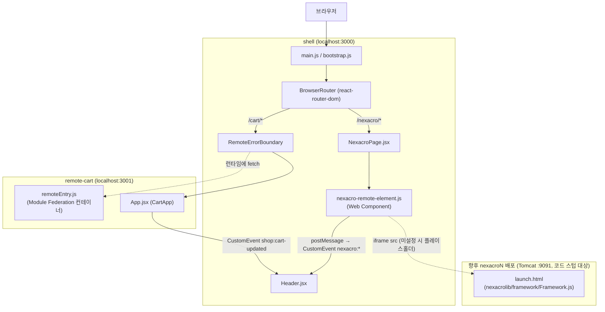
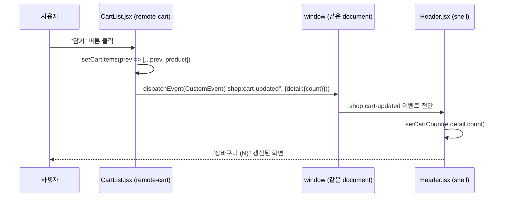
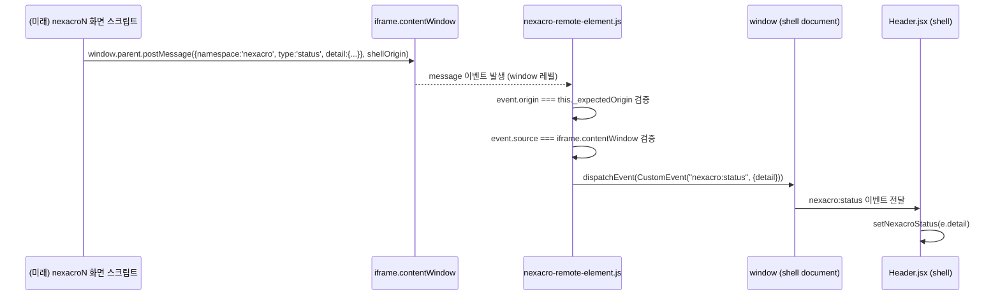

# MFE 샘플 동작 흐름

`MFE/마이크로 프론트엔드(MFE) 정리.md`에서 정리한 Module Federation 아키텍처를 `MFE/sample/`에 실제로 구현한 결과물의 동작 흐름을 상세히 설명한다. 개념이 아니라 **이 저장소에 실제로 존재하는 코드**를 기준으로 작성했다.

---

## 1. 프로젝트 구조

```
MFE/
├── 마이크로 프론트엔드(MFE) 정리.md
├── MFE_샘플_동작_흐름.md                (이 문서)
└── sample/
    ├── package.json                     — npm workspaces 루트 (shell, remote-cart)
    ├── .gitignore                       — dist/, .cache/
    ├── shell/                           — 호스트(셸) 앱, 포트 3000
    │   ├── package.json
    │   ├── webpack.config.js
    │   ├── public/index.html
    │   └── src/
    │       ├── index.js                 — 진입점 (bootstrap 동적 import)
    │       ├── bootstrap.js             — 실제 React 렌더 + 커스텀 엘리먼트 등록
    │       ├── App.jsx                  — 라우터, /cart /nexacro 라우트 정의
    │       ├── components/
    │       │   ├── Header.jsx           — 장바구니 카운트, nexacro 상태 표시
    │       │   └── RemoteErrorBoundary.jsx
    │       ├── pages/
    │       │   ├── Home.jsx
    │       │   └── NexacroPage.jsx      — <nexacro-remote> 마운트
    │       └── webcomponents/
    │           └── nexacro-remote-element.js  — nexacroN 연동 확장 지점 (코드 스텁)
    └── remote-cart/                     — remote 앱, 포트 3001
        ├── package.json
        ├── webpack.config.js
        ├── public/index.html            — 독립 실행용 HTML
        └── src/
            ├── index.js
            ├── bootstrap.js             — 독립 실행 시에만 사용 (BrowserRouter basename="/cart")
            ├── App.jsx                  — CartApp, shell에 노출되는 실제 컴포넌트
            └── pages/
                ├── CartList.jsx         — 상품 목록, "담기" 버튼
                └── Checkout.jsx         — 결제 요약
```

### 포트 표

| 앱 | 포트 | 역할 | 실행 명령 |
|---|---|---|---|
| shell | 3000 | 호스트(컨테이너) 앱, 모든 트래픽의 진입점 | `npm run dev -w shell` |
| remote-cart | 3001 | Module Federation remote, `/remoteEntry.js` 노출 | `npm run dev -w remote-cart` |

nexacroN은 별도 포트를 새로 여는 대신, **shell 안의 iframe이 가리키는 기존 nexacroN 배포 포트(9091, `apache-tomcat-9.0.89`)를 그대로 재사용**한다. 자세한 내용은 6장 참고.

---

## 2. 설치 및 실행 방법

```bash
cd MFE/sample
npm install              # workspaces(shell, remote-cart) 의존성 일괄 설치
npm run dev              # remote-cart(3001) + shell(3000) 동시 기동 (concurrently)
```

- `npm run dev`는 `concurrently`로 두 webpack-dev-server를 동시에 띄운다. 터미널 로그에 `[cart]`, `[shell]` 접두사가 붙어 어느 앱의 로그인지 구분된다.
- 개별 실행: `npm run dev:cart` / `npm run dev:shell`
- 접속: 브라우저에서 **`http://localhost:3000`** 만 열면 된다. `http://localhost:3001`은 remote-cart를 독립적으로 확인하고 싶을 때만 직접 접속한다 (이 경우 `basename="/cart"`가 적용되므로 실제로는 `http://localhost:3001/cart`로 리다이렉트되는 형태로 동작).

### 정상 기동 확인 방법

```bash
curl http://localhost:3000                    # shell index.html, 200
curl http://localhost:3001/remoteEntry.js      # cart의 Module Federation 컨테이너, 200
```

두 webpack-dev-server 콘솔에 `webpack 5.x.x compiled successfully`가 뜨면 정상이다.

---

## 3. 아키텍처 개요



**핵심 구분**: `cart`는 **진짜 Module Federation remote**(런타임에 JS 모듈로 로드)이고, `nexacro`는 **iframe + Web Component 어댑터**(문서/스텁 상태, 문서 2장의 "iframe" 통합 방식)다. 이 둘은 통합 메커니즘이 다르지만, 셸 입장에서는 최종적으로 둘 다 "window `CustomEvent`를 통해 상태를 알려주는 대상"으로 동일하게 취급된다 (`Header.jsx`가 `shop:cart-updated`와 `nexacro:status`를 같은 방식으로 구독).

---

## 4. 요청 단계별 흐름 (셸 최초 로드 → 장바구니 진입)

1. 브라우저가 `http://localhost:3000/` 요청 → `shell/public/index.html` 수신
2. `index.html`이 `main.js`(webpack entry) 로드
3. `shell/src/index.js`가 `import('./bootstrap')` 실행 — 여기서 처음으로 `react`/`react-dom` 등 **공유 의존성 버전 협상**이 비동기로 일어난다. 진입점을 `index.js` / `bootstrap.js`로 분리한 이유가 이것 — 협상이 끝나기 전에 `react`를 동기 import하면 `Shared module is not available for eager consumption` 에러가 난다 (8장 트러블슈팅 참고)
4. `bootstrap.js`가 `createRoot(...).render(<BrowserRouter><App /></BrowserRouter>)` 실행, 동시에 `./webcomponents/nexacro-remote-element`를 import해 `customElements.define('nexacro-remote', ...)`를 등록
5. `App.jsx`가 `/` 경로 매칭 → `Home.jsx` 렌더
6. 사용자가 "장바구니" 링크 클릭 → 클라이언트 사이드 라우팅으로 `/cart` 이동 (실제 HTTP 요청 없음)
7. `App.jsx`의 `<Route path="/cart/*">`가 매칭되며 `React.lazy(() => import('cart/Cart'))`가 트리거됨
8. 이 시점에 처음으로 브라우저가 **`http://localhost:3001/remoteEntry.js`를 fetch** — 이것이 `cart` 컨테이너의 매니페스트(어떤 모듈을 `expose`하는지, 어떤 의존성을 `shared`로 요구하는지)
9. webpack Module Federation 런타임이 `remoteEntry.js`의 `shared.react` 요구 버전과 shell이 이미 로드한 `react` 버전을 비교 — `singleton: true`이므로 호환되면 **shell의 react 인스턴스를 그대로 재사용**(중복 로드 없음)
10. `cart/Cart`가 가리키는 실제 청크(`src_App_js.js` 등)를 다운로드
11. `RemoteErrorBoundary` + `Suspense` 안에서 `CartApp`이 마운트되어 `remote-cart/src/App.jsx`가 렌더링됨
12. `CartApp` 내부의 `<Routes>`가 `/`(중첩 기준으로는 `/cart`) 경로에서 `CartList.jsx`를 렌더

이 시점부터 `/cart` 아래는 완전히 `remote-cart`가 소유한다 (5장 라우팅 참고).

---

## 5. 라우팅 통합 흐름

**원칙 (문서 5장과 동일): 셸이 1차 경로를 소유하고, 각 remote는 자기 경로 아래 하위 라우팅만 소유한다.**

```jsx
// shell/src/App.jsx
<Route path="/cart/*" element={...CartApp...} />
<Route path="/nexacro/*" element={<NexacroPage />} />
```

```jsx
// remote-cart/src/App.jsx — 노출 컴포넌트, 라우터를 감싸지 않음
<Routes>
  <Route path="/" element={<CartList .../>} />        {/* 실제 URL: /cart */}
  <Route path="/checkout" element={<Checkout .../>} /> {/* 실제 URL: /cart/checkout */}
</Routes>
```

- `remote-cart/src/App.jsx`(CartApp, 노출 대상)는 `<Routes>`만 갖고 `<BrowserRouter>`를 감싸지 **않는다**. 셸의 `BrowserRouter` 히스토리 객체를 그대로 물려받기 위함이다.
- `remote-cart/src/bootstrap.js`(독립 실행 전용, `http://localhost:3001`로 직접 열었을 때만 사용)에서만 `<BrowserRouter basename="/cart">`로 감싼다.
- `react-router-dom`을 `webpack.config.js`의 `shared`에 `singleton: true`로 등록한 이유: 만약 shell과 cart가 각자 다른 `react-router-dom` 인스턴스를 로드하면 **히스토리 객체가 두 개**가 되어, cart 내부에서 `navigate('/checkout')`을 호출해도 셸의 URL 표시줄에 반영되지 않는 버그가 생긴다.
- `/nexacro/*`는 React 컴포넌트 트리 안에서 끝난다 — `NexacroPage.jsx`가 `<nexacro-remote>`를 렌더할 뿐, 그 안의 iframe 내부 라우팅(실제 nexacroN 화면 전환)은 iframe의 별도 document이므로 브라우저 주소창에 반영되지 않는다 (딥링크가 필요하면 향후 iframe 내부 경로를 postMessage로 셸에 알려 URL 쿼리 파라미터에 반영하는 식으로 확장 가능 — 현재 스텁에는 미구현).

### 새로고침/딥링크 대응

`shell/webpack.config.js`의 `devServer.historyApiFallback: true`가 `/cart`, `/cart/checkout`, `/nexacro` 등 어떤 경로로 새로고침해도 `index.html`을 서빙하도록 처리한다. 실제 프로덕션 배포 시에도 서버/CDN에 동일한 SPA fallback 설정이 필요하다 (문서 5장 "실무 이슈"와 동일).

---

## 6. 상태 공유 흐름 (CustomEvent)

### 6-1. cart → header (Module Federation remote, 같은 document)



- 실제 코드 위치: `remote-cart/src/App.jsx`의 `addToCart` 함수, `shell/src/components/Header.jsx`의 `useEffect`
- 이벤트 이름에 `shop:` 네임스페이스를 붙여 다른 MFE의 이벤트와 충돌을 방지한다 (문서 4장 규칙 ①)
- `detail`에는 `{ count: number }`만 담아 직렬화 가능한 값만 전달한다 (규칙 ②)
- shell과 cart는 **같은 브라우저 document**를 공유하므로(Module Federation은 iframe이 아니라 같은 window에 모듈을 로드) `window.dispatchEvent`/`window.addEventListener`가 그대로 통한다.

### 6-2. nexacro-remote → header (iframe, 다른 document — postMessage 브리지 필요)

cart와 달리 `<nexacro-remote>`는 내부에 **별도 document를 가진 iframe**을 만들기 때문에 `window.dispatchEvent`가 부모-자식 간에 직접 전달되지 않는다. 그래서 `nexacro-remote-element.js`가 `postMessage` ↔ `CustomEvent` **변환 브리지** 역할을 한다.



- 실제 코드 위치: `shell/src/webcomponents/nexacro-remote-element.js`의 `_handleMessage`
- **origin 검증이 필수**인 이유: `postMessage` 리스너는 기본적으로 어떤 origin에서 온 메시지든 받을 수 있어, 검증 없이 신뢰하면 다른 탭/사이트가 위조 메시지를 보내 셸 상태를 조작할 수 있다 (스푸핑). `_expectedOrigin`은 `<nexacro-remote src="...">`의 origin으로 고정되며, `event.origin`과 `event.source`(iframe.contentWindow) 둘 다 검증한다.
- 브리지를 거친 뒤에는 `nexacro:${type}` 형태의 **일반 window CustomEvent**로 재발행되므로, `Header.jsx` 입장에서는 cart의 이벤트를 구독할 때와 코드 패턴이 동일하다 — Module Federation remote든 iframe remote든 셸의 "상태 소비 코드"는 하나의 패턴(window CustomEvent 구독)으로 통일된다.

---

## 7. 오류 격리 (RemoteErrorBoundary)

`remote-cart` 서버가 꺼져 있거나 `remoteEntry.js` fetch가 실패하면 `React.lazy(() => import('cart/Cart'))`가 reject된다. `shell/src/components/RemoteErrorBoundary.jsx`가 이를 잡아 셸 전체가 하얀 화면으로 죽는 대신 `/cart` 영역에만 오류 메시지를 표시한다.

**검증 방법**: `remote-cart` dev server를 끈 상태에서 `/cart`로 이동 → "cart 원격 모듈을 불러오지 못했습니다..." 메시지가 그 영역에만 표시되고, `Header`나 `Home` 등 셸의 나머지 부분은 정상 동작해야 한다.

---

## 8. nexacroN 확장 지점 상세 (코드 스텁)

### 8-1. 왜 Module Federation이 아니라 iframe + Web Component인가

조사 결과 `nexacroN_generate/output/`의 실제 산출물(`launch.html`, `App_Desktop.xadl.js` 등)은 다음과 같은 구조다:

```html
<!-- launch.html (실제 산출물) -->
<script src="./nexacrolib/framework/Framework.js"></script>
<script>
  var screeninfo = { "xadl": "App_Desktop.xadl.js", ... };
  nexacro._loadADL(screeninfo, ...);
</script>
```

이는 Webpack의 `ModuleFederationPlugin`이 요구하는 컨테이너 포맷(`__webpack_require__.federation`, `remoteEntry.js`의 `moduleMap`/`get`/`init` 인터페이스)과 전혀 다른, nexacroN 자체 로더(`nexacro._loadADL`) 기반 구조다. 따라서 **nexacroN을 진짜 Module Federation remote로 등록하는 것은 불가능**하며, 이 저장소에 이미 있는 iframe 임베딩 선례(`nexacroN_rules.md`의 eGovFrame 연동: `<iframe src="/nexa_ui/launch.html">`)를 확장하는 것이 유일하게 현실적인 방법이다.

md 문서(`마이크로 프론트엔드(MFE) 정리.md`) 2장의 통합 방식 비교표 기준으로는:

| 방식 | nexacroN 적용 가능 여부 |
|---|---|
| Module Federation | 불가 (nexacroN이 webpack 컨테이너가 아님) |
| Web Components | **가능** — 프레임워크 중립이라 셸이 React여도 상관없음 |
| iframe | **가능** — 완전한 격리, 기존 선례 존재, nexacroN처럼 전역 네임스페이스(`nexacro.*`)를 쓰는 레거시 프레임워크에 특히 적합 |

→ 이 둘을 합쳐 "iframe을 감싼 Web Component"로 구현했다.

### 8-2. `<nexacro-remote>` 커스텀 엘리먼트 동작

파일: `shell/src/webcomponents/nexacro-remote-element.js`

| 속성/동작 | 설명 |
|---|---|
| `src` (attribute) | nexacroN `launch.html`의 실제 URL. 비어있으면 플레이스홀더만 표시 |
| `connectedCallback` / `attributeChangedCallback` | DOM에 붙거나 `src`가 바뀌면 `_render()` 재실행 |
| `_render()` | `src` 없음 → 플레이스홀더 div, `src` 있음 → `sandbox` 속성이 있는 `<iframe>` 생성 |
| `sandbox="allow-scripts allow-same-origin allow-forms"` | nexacroN 실행에 필요한 최소 권한만 부여. `allow-same-origin`은 postMessage 통신을 위해 필요하지만 격리 효과를 낮추므로, **반드시 신뢰할 수 있는 사내 nexacroN 배포 origin에만** 사용해야 한다 |
| `_handleMessage()` | `event.origin`과 `event.source`를 모두 검증한 뒤 `{namespace:'nexacro', type, detail}` 스키마 메시지를 `nexacro:${type}` CustomEvent로 재발행 |
| `disconnectedCallback` | `window` `message` 리스너 정리 (메모리 누수 방지) |

### 8-3. 실제 nexacroN 배포로 전환하는 절차 (체크리스트)

1. **Tomcat 기동 확인**: `tools/start_tomcat.bat` 실행, `http://localhost:9091/`이 응답하는지 확인 (`apache-tomcat-9.0.89/conf/server.xml`의 HTTP Connector가 `port="9091"`로 설정되어 있음이 조사로 확인됨)
2. **launch.html 경로 확정**: nexacroN 프로젝트를 `nexacrodeploy`(`NexacroN_Deploy_JAVA.jar`)로 빌드/배포한 뒤, Tomcat `webapps/` 아래 실제 배포 경로 확인 (예: `http://localhost:9091/REQM/nexacroN_v24/.../launch.html`)
3. **셸에 URL 주입**: `shell/webpack.config.js`의 `EnvironmentPlugin`에 넘기는 `NEXACRO_REMOTE_URL` 환경변수를 위 경로로 설정 후 `npm run dev` 재기동 — 코드 수정 불필요, 환경변수만 바꾸면 `NexacroPage.jsx`가 자동으로 실제 URL을 `<nexacro-remote src=...>`에 전달
4. **X-Frame-Options / CSP 확인**: nexacroN을 서빙하는 Tomcat 응답 헤더에 `X-Frame-Options: DENY`나 `Content-Security-Policy: frame-ancestors 'none'`이 있으면 iframe 자체가 차단된다. 필요 시 `frame-ancestors http://localhost:3000 http://<운영셸도메인>`으로 완화
5. **CORS**: `<nexacro-remote>`는 iframe이므로 원칙적으로 cart처럼 `Access-Control-Allow-Origin` CORS 헤더가 필요 없다(iframe은 문서 임베딩이라 fetch CORS 규칙과 무관). 다만 nexacroN 내부 스크립트가 셸 origin으로 XHR/fetch를 별도로 호출한다면 그 경로에는 CORS 설정이 필요하다
6. **postMessage 발신 코드 추가**: nexacroN 쪽 스크립트(`.xfdl`의 `<Script>` 또는 Framework 커스터마이징)에서 상태 변화 시
   ```javascript
   window.parent.postMessage(
     { namespace: 'nexacro', type: 'status', detail: { screen: 'main', userId: 'hong' } },
     'http://localhost:3000' // 실제로는 운영 셸 origin
   );
   ```
   형태로 발신하도록 추가해야 `nexacro-remote-element.js`가 이를 받아 `Header.jsx`에 반영할 수 있다 (현재는 발신 측 코드가 없으므로 `nexacro:status` 이벤트는 실제로 발생하지 않음 — 이 부분이 "코드 스텁"의 의미)
7. **postMessage 수신(옵션)**: 반대로 셸 → nexacroN 방향 통신이 필요하면(예: 로그인 토큰 전달) `iframe.contentWindow.postMessage(...)`를 셸 쪽에 추가로 구현해야 한다 — 현재 스텁에는 미구현

---

## 9. 트러블슈팅

| 증상 | 원인 | 해결 |
|---|---|---|
| `Shared module is not available for eager consumption` | 진입점(`index.js`)에서 `react` 등을 동기 import함 | `index.js`는 `import('./bootstrap')`만 하고, 실제 React 코드는 `bootstrap.js`로 분리 (이미 적용됨) |
| `/cart` 접근 시 CORS 에러로 `remoteEntry.js` 로드 실패 | remote-cart devServer가 CORS 헤더를 안 보냄 | `remote-cart/webpack.config.js`의 `devServer.headers`에 `Access-Control-Allow-Origin: *` 설정됨 (이미 적용) — 프로덕션에서는 실제 셸 origin으로 제한 권장 |
| cart 내부에서 `navigate()`해도 셸 주소창이 안 바뀜 | `react-router-dom`이 `shared.singleton`이 아니어서 히스토리 인스턴스가 2개로 분리됨 | 양쪽 `webpack.config.js`의 `shared['react-router-dom']`이 `singleton: true`인지 확인 |
| `nexacro:status` 이벤트가 절대 안 옴 | `NEXACRO_REMOTE_URL` 미설정(스텁 상태) 또는 nexacroN 쪽에 `postMessage` 발신 코드 없음 | 8-3의 체크리스트 순서대로 실제 배포 연결 |
| `<nexacro-remote>`가 빈 iframe만 보임 | `event.origin` 불일치로 브리지가 메시지를 버림 (콘솔에는 에러가 안 뜸 — 조용히 무시되는 설계) | `src`의 origin과 nexacroN이 `postMessage`에 넘긴 targetOrigin이 정확히 일치하는지 확인 |
| `RemoteErrorBoundary`가 안 뜨고 화면 전체가 하얗게 됨 | 에러가 `Suspense`/`lazy` 바깥, 즉 `RemoteErrorBoundary`로 감싸지 않은 다른 위치에서 발생 | `App.jsx`에서 새로 추가하는 원격 라우트도 반드시 `RemoteErrorBoundary`로 감쌀 것 |

---

## 10. 향후 확장 시 참고

- 새로운 React 기반 remote를 추가하려면: `remote-cart`를 복사해 `name`/`exposes`/포트만 바꾸고, `shell/webpack.config.js`의 `remotes`에 한 줄 추가, `App.jsx`에 라우트 한 줄 추가 — 이 패턴이 md 문서 3장 그대로 반복된다.
- nexacroN 외에 다른 레거시/타 프레임워크 화면을 붙일 때도 `<nexacro-remote>`와 동일한 "iframe + postMessage 브리지" 패턴을 재사용할 수 있다 (엘리먼트 이름과 메시지 스키마만 바꾸면 됨).
- 셸-원격 간 통신 스키마(`shop:cart-updated`, `nexacro:status` 등)는 팀 간 계약이므로, 실제 다팀 조직에서 쓴다면 이 문서의 6장 내용을 팀 공유 문서로 승격하는 것을 권장한다 (md 문서 4장 "이벤트 이름·페이로드 스키마를 팀 간 계약으로 문서화" 원칙).
